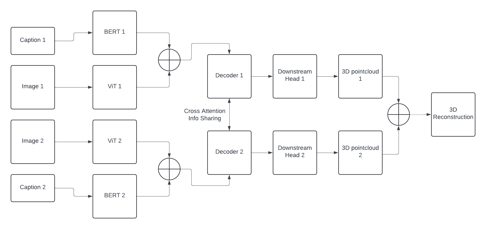

# Multimodal 3D Reconstruction
## Overview
This project aims to reconstruct 3D pointclouds from pairs of images using multimodal image data. Specifically, the core model built in the repo is `AsymmetricCroCo3DStereoAndText` defined in `dust3r/model_exif.py`, which consists of a Vision Transformer (ViT) and BERT text transformer.

The architecture builds off of the [dust3r](http://github.com/naver/dust3r) model architecture, defined as `AsymmetricCroCo3DStero` in `dust3r/model.py`, as well as the text encoder from [Exif As Language](https://github.com/hellomuffin/exif-as-language). The specifics are described in more detail below.

Given an image-caption pair of a given 3D scene, the model is capable of generating a 3D point cloud representing the original scene.

## Model Architecture
The input consists of a pair of image-caption pairs. Each image is fed into the ViT and each caption is fed into the text encoder, with the resulting embeddings concatenated together.

The two concatenated embeddings are then each fed into a decoder, with the two decoders applying cross attention to share information with one another. Finally, each decoder's output is fed to a downstream head used to convert the output into a 3D pointmap, which are then aligned and superimposed based on camers extrinsics and intrinsics to generate the final 3D reconstruction.

This architecture is visualized in the following image:


## Training
To train the model, simply run the training script with the `AsymmetricCroCo3DStereoAndText` model on any preprocessed dataset.

An example of preprocessing the [megascenes](https://arxiv.org/abs/2406.11819) dataset can be found in `/dust3r/datasets/megascenes.py`.

Using this dataset, the model can be trained using the following command, for example:
```bash
python3 train.py --train_dataset "MegaScenes('<pair_info_path>', '<serialized_path>', split='train', resolution=(224,224))" --test_dataset "MegaScenes('<pair-info-path>', '<serialized_path>',split='test', resolution=(224, 224))" --model "AsymmetricCroCo3DStereoAndText(patch_embed_cls='ManyAR_PatchEmbed', img_size=(224, 224), depth_mode=('exp', -inf, inf), conf_mode=('exp', 1, inf), enc_embed_dim=1024, enc_depth=24, enc_num_heads=16, dec_embed_dim=768, dec_depth=12, dec_num_heads=12)" --output_dir checkpointed_out
```

Training hyperparameters and arguments (batch size, output dir, etc) can be set based on the arguments specified in `train.py`.

The model can currently load weights from the Exif as Language model and Dust3r model for its Text and Image transformers, respectively, in order to fine tune these models and ultimately reduce training time.

To do so, use the `--duster_path` and `--exif_path` flags as such:
```bash
python3 train.py --train_dataset "MegaScenes('<pair_info_path>', '<serialized_path>', split='train', resolution=(224,224))" --test_dataset "MegaScenes('<pair-info-path>', '<serialized_path>',split='test', resolution=(224, 224))" --model "AsymmetricCroCo3DStereoAndText(patch_embed_cls='ManyAR_PatchEmbed', img_size=(224, 224), depth_mode=('exp', -inf, inf), conf_mode=('exp', 1, inf), enc_embed_dim=1024, enc_depth=24, enc_num_heads=16, dec_embed_dim=768, dec_depth=12, dec_num_heads=12)" --output_dir checkpointed_out --duster_path <duster_weights_path> --exif_path <exif_wrapper_path>
```

## Demo
A gradio demo can be run for the Multimodal reconstruction model via the code found in `demo_exif.py`. Simply run the following command to do so:
```bash
python3 demo_exif.py --weights <path_to_saved_weights> --local_network --image_size 224
```